# JURISDICTION ANALYTICS REPORT

| File | Flat Viewer |
|--|--|
|**idtot_df.csv**  *Top 100 ATI Packages by Number of Informal Requests for All Time.*  | |
|**org_df.csv** Number of Informal Requests by organization by month.||
|**orgtot.csv contains** Total Innformal Requests by organization.||
|**top_10_df.csv**  Top 10 packages by informal requsts by month.||

## Downloads by Jurisdiction last 12 months

## Visits by Jurisdiction last 12 months

```mermaid

xychart-beta
    title "Visits by Jurisdiction 🟦Fed 🟩Prov 🟥Muni"
    x-axis [2024-10, 2024-11, 2024-12, 2025-1, 2025-2, 2025-3, 2025-4, 2025-5, 2025-6, 2025-7, 2025-8, 2025-9]
    y-axis "Visits" 0 --> 272042
    line [251551, 227042, 184989, 241280, 223373, 252966, 272032, 193042, 189470, 204827, 162129, 227055]
    line [67537, 58972, 50146, 69108, 64198, 77053, 81930, 63910, 63117, 63346, 53201, 78410]
    line [6643, 6053, 4970, 6013, 6298, 7116, 7801, 5126, 4797, 5298, 4430, 5839]
```

## Open Maps Views by Jurisdiction last 12 months

```mermaid

xychart-beta
    title "Open Maps Views by Jurisdiction 🟦Fed 🟩Prov 🟥Muni"
    x-axis [2024-8, 2024-9, 2024-10, 2025-1, 2025-2, 2025-3, 2025-4, 2025-5, 2025-6, 2025-7, 2025-8, 2025-9]
    y-axis "Open Maps Views" 0 --> 18369
    line [11826, 14281, 16769, 16596, 15623, 17686, 18359, 13250, 12379, 13343, 12366, 15153]
    line [1829, 3333, 5074, 5206, 4704, 5150, 4987, 5778, 5667, 5922, 7554, 6011]
    line [17, 14, 36, 52, 45, 47, 42, 52, 51, 71, 72, 68]
```

