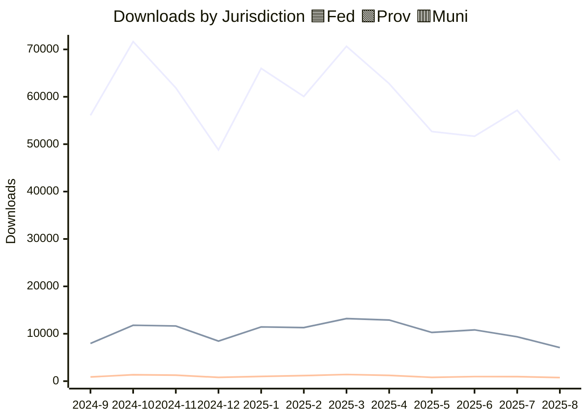
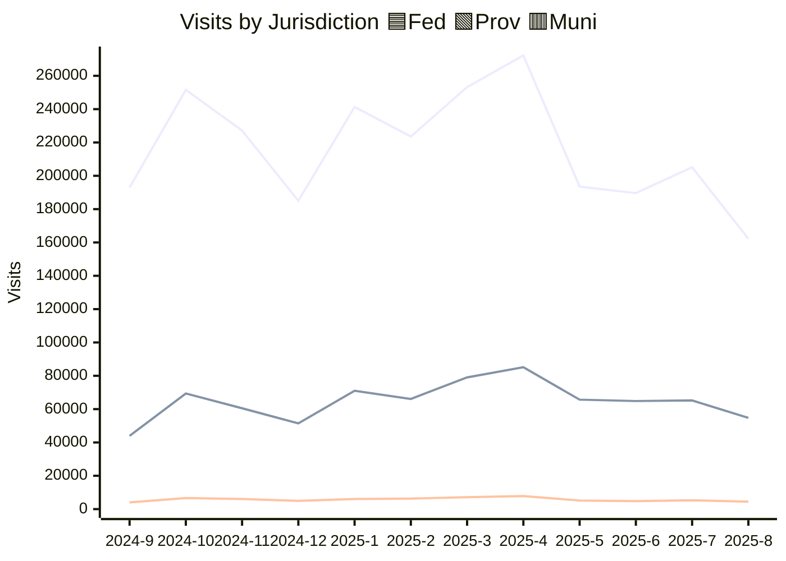
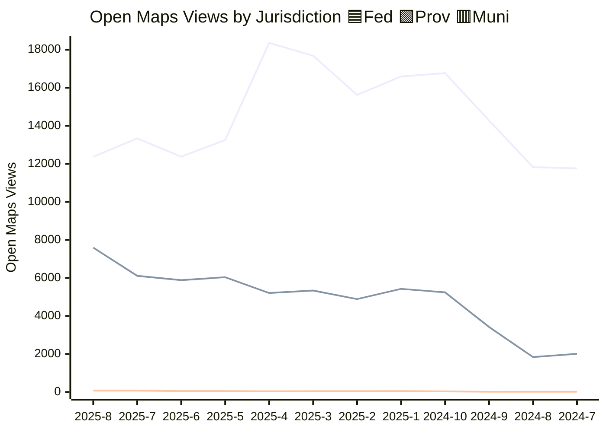

## Downloads by Jurisdiction last 12 months

```mermaid

xychart-beta
    title "Downloads by Jurisdiction 🟦Fed 🟩Prov 🟥Muni"
    x-axis [2024-9, 2024-10, 2024-11, 2024-12, 2025-1, 2025-2, 2025-3, 2025-4, 2025-5, 2025-6, 2025-7, 2025-8]
    y-axis "Downloads" 0 --> 71663
    line [56076, 71653, 61880, 48792, 66001, 60081, 70650, 62777, 52664, 51665, 57151, 46588]
    line [7950, 11799, 11641, 8460, 11443, 11295, 13206, 12898, 10272, 10819, 9363, 7080]
    line [878, 1357, 1262, 796, 1000, 1168, 1406, 1221, 804, 965, 953, 747]
```

## Visits by Jurisdiction last 12 months

```mermaid

xychart-beta
    title "Visits by Jurisdiction 🟦Fed 🟩Prov 🟥Muni"
    x-axis [2024-9, 2024-10, 2024-11, 2024-12, 2025-1, 2025-2, 2025-3, 2025-4, 2025-5, 2025-6, 2025-7, 2025-8]
    y-axis "Visits" 0 --> 272212
    line [192949, 251571, 227132, 185011, 241284, 223568, 253217, 272202, 193513, 189639, 205080, 162267]
    line [43933, 69359, 60503, 51440, 70988, 66088, 79028, 85126, 65681, 64844, 65226, 54721]
    line [4035, 6661, 6086, 4983, 6050, 6321, 7156, 7832, 5146, 4804, 5324, 4438]
```

## Open Maps Views by Jurisdiction last 12 months

```mermaid

xychart-beta
    title "Open Maps Views by Jurisdiction 🟦Fed 🟩Prov 🟥Muni"
    x-axis [2025-8, 2025-7, 2025-6, 2025-5, 2025-4, 2025-3, 2025-2, 2025-1, 2024-10, 2024-9, 2024-8, 2024-7]
    y-axis "Open Maps Views" 0 --> 18369
    line [12366, 13343, 12379, 13250, 18359, 17686, 15623, 16596, 16769, 14281, 11826, 11760]
    line [7594, 6110, 5883, 6039, 5207, 5336, 4888, 5426, 5243, 3422, 1839, 2009]
    line [72, 71, 51, 52, 42, 47, 45, 52, 36, 14, 17, 15]
```
